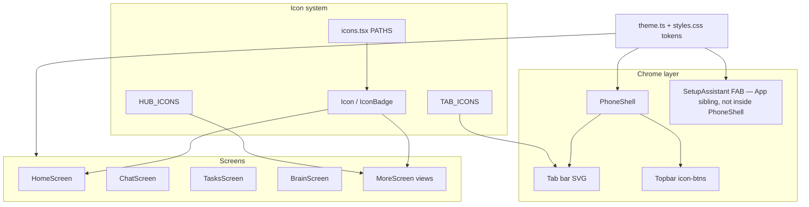
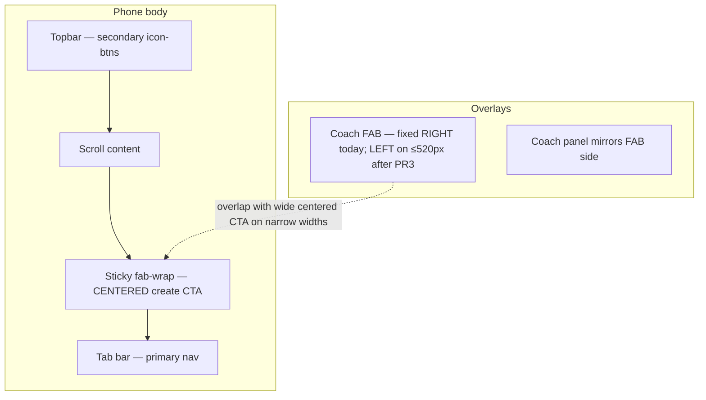
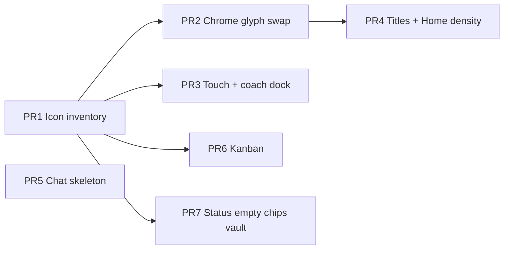

# Mobile UI & icon polish — OpenClaw One / MobileClaw public demo

| Field | Value |
|-------|--------|
| **Author** | Design revision (review pass) |
| **Date** | 2026-07-14 |
| **Status** | Draft (revised) |
| **Product** | OpenClaw One public demo (`openclaw-one`) |
| **Live** | https://openclaw-one.pages.dev |
| **Stack** | Vite + React + TypeScript · Cloudflare Pages (direct-upload) |
| **Visual lock** | Deep OLED structure + Soft Aurora dark · crisp OLED light |
| **Related** | `docs/DESIGN-PLUGIN-FINDINGS.md`, `docs/FEATURES.md`, `src/components/icons.tsx` |

---

## Overview

The public MobileClaw demo already shipped a major chrome upgrade: Lucide-style stroke SVGs for bottom tabs, home tiles, More hub rows, Brain filter chips, task checks, and the Setup coach FAB. Emoji remains only as **content** (persona avatars, trip covers). The locked look is **Deep OLED structure + Soft Aurora night** in dark mode, with three user-pickable button systems (`data-btn`: solid | soft | glow).

This design covers the **next polish pass**: complete the icon language for remaining chrome, fix hierarchy and density issues that still feel unfinished on a phone, harden thumb-zone targets, and ship loading / kanban affordances without reopening palette or multi-layout thrash.

Work is split into small, independently deployable PRs so each can land on Cloudflare Pages and be verified on a real device.

---

## Background & Motivation

### Current architecture (relevant)



| Area | Path | Role today |
|------|------|------------|
| Icon system | `src/components/icons.tsx` | Single-path stroke SVGs; `Icon`, `IconBadge`, maps |
| Shell | `src/components/PhoneShell.tsx` | Notch, topbar, 5-tab bar, desktop rails |
| Theme | `src/theme.ts` + `src/styles.css` | `data-design=oled`, `data-theme`, `data-btn` |
| Screens | `src/components/screens/*` | Home / Chat / Tasks / Brain / More |
| Coach | `src/components/SetupAssistant.tsx` | FAB + panel (rendered as **App sibling**, not child of PhoneShell) |
| Seed | `src/data/seed.ts` | Demo data; personas/trips keep content emoji |
| App titles | `src/App.tsx` | Already passes `title` for More views (naive capitalize) |

### What is already good

- No emoji as structural nav or system icons (plugin anti-pattern fixed).
- Tabs: icon + label, stroke 1.75 idle / 2.1 active, 5 items max.
- Chips and task checks: min-height 44px, press scale ~0.97.
- `prefers-reduced-motion` global kill switch in CSS.
- Button systems and theme tokens stay cohesive across light/dark.
- Inter loaded; density matches ops / AI-tool product (not marketing site chrome).
- More topbar titles already wired in `App.tsx` (labels need product map; see §4).

### Pain points remaining

1. **Chrome still uses text glyphs** for close (`✕`), back (`←`), and create (`+`) — breaks the single stroke language and renders inconsistently across platforms.
2. **Icon inventory incomplete** for chrome actions: close, plus, search, pin, send, lock/unlock, grip, arrow-left, empty/inbox (agent status is CSS, not an icon path).
3. **Touch targets under 44px** on topbar `.icon-btn` (38×38), vault reveal text links, search field 42px; pills have no min-height.
4. **Visual hierarchy**: primary screens repeat a large title under an already-titled topbar; Home packs two overlapping entry grids (quick actions + features); More titles use naive capitalize (`paywall` → “Paywall” vs hub “Plans”).
5. **Inconsistent chip language**: Brain has `chip-ico` with SVG; Tasks filters are text-only chips.
6. **Loading feedback**: Chat and coach show “Thinking…” with no skeleton when network exceeds ~300ms (plugin open item).
7. **Kanban affordance**: HTML5 DnD works, but first-time users get only copy (“drag or tap”) — no grip icon or one-shot gesture hint (plugin open item).
8. **Status & empty states**: agent status is plain text; empty lists are dashed boxes with no icon.
9. **FAB / create overlap**: sticky **centered** `.fab-wrap` create CTAs and a **right-fixed** coach FAB overlap on narrow phones (not two right-corner FABs).
10. **IconBadge tones underused**: most hub rows use default primary; category/status color is only on list border-left.

### Non-product constraints

- Public demo: localStorage only, no real secrets, vault rejects credential-like strings.
- Deploy: Cloudflare Pages direct-upload — each PR can ship independently after `vite build` + wrangler deploy + git push.
- Do not invent new seed narratives or fake product claims; polish presentation of existing surfaces.

---

## Goals & Non-Goals

### Goals

1. **Icon completeness for chrome** — system controls (close, back, add, search, pin, send, lock, drag grip, empty chrome) use the shared SVG system. Agent status uses CSS dots (not SVG).
2. **Touch & thumb-zone compliance** — interactive chrome ≥44×44px; coach FAB and centered create CTAs do not fight on narrow widths.
3. **Hierarchy & density** — correct More topbar labels via `MORE_VIEW_TITLES`; drop redundant large titles with a spacing plan; Home features grid without duplicate destinations.
4. **Loading & motion polish** — single pending UI (skeleton after 300ms); honor reduced-motion; transitions 150–300ms.
5. **Kanban first-use clarity** — grip affordance + dismissible one-shot hint; hint cleared on demo reset.
6. **Ship incrementally** — each PR reviewable, mergeable, and deployable alone.

### Non-Goals

- Reopening OLED vs Aurora vs Liquid (or any multi-palette compare UI).
- Replacing Inter with Plus Jakarta Sans (optional later; not this pass).
- Converting persona/trip content emoji to SVG (content stays emoji).
- Real auth, Stripe, image generation, WebSocket agent health, or native-only features.
- Full Playwright visual regression CI (optional follow-up; not required to close this design).
- Redesigning desktop rails marketing copy.
- New feature surfaces beyond presentation of existing ones.
- Per-route coach occupancy plumbing (`fabOccupied` on PhoneShell) — rejected; CSS dock is the contract.
- Hiding coach FAB after `coachSeen` as the primary thumb fix (kept as alternative; left-dock is the chosen path so new visitors still see Setup).

---

## Proposed Design

### 1. Icon system extension

Extend `src/components/icons.tsx` only. Keep the existing contract:

- 24×24 viewBox, `fill="none"`, `stroke="currentColor"`
- Default `strokeWidth={1.75}`; active / selected may use `2.1`
- Parent colors via CSS tokens / `currentColor`
- `aria-hidden` unless `title` is passed

#### New `IconName` values (minimum set)

| Name | Lucide reference | Primary use | Default render size |
|------|------------------|-------------|---------------------|
| `x` | `x` | Modal close, coach close | 18 (icon-btn) |
| `plus` | `plus` | Create CTAs, “New” chips | 16 in chips/buttons |
| `arrow-left` | `arrow-left` | More subview back chip | 16 |
| `search` | `search` | Brain search field leading adornment | 16–18 |
| `pin` | `pin` | Note pin / unpin chip | 14 |
| `send` | `send` | Chat / coach send (with label) | 16 |
| `lock` | `lock` | Vault “Lock vault” button | 16 |
| `unlock` | `lock-open` | Vault “Unlock” button | 16 |
| `grip` | `grip-vertical` | Kanban card drag handle | 14 |
| `inbox` | `inbox` | Empty-state illustration | 28 |
| `alert` | `triangle-alert` | Optional inline error (PR7 if needed) | 16 |

**Not in the SVG set:** agent status. Use CSS-only `.status-dot` (see §7). Do not add `status`, `circle`, or a `StatusIcon` helper.

Paths stay single-string Lucide-style (match current `PATHS` pattern). Copy geometry from Lucide MIT paths at 24×24; hand-tune optical center if needed. Prefer one path per icon; multi-stroke glyphs may use compound path strings as today (`image`, `sliders`).

**Implementers:** paste final `d` strings from Lucide’s published SVG for the names above so stroke weight matches existing icons. Review PR1 for path quality at 14 / 18 / 22 / 28 px on OLED dark and light.

#### Helpers

**Do not add `ChipIcon` or `StatusIcon`.** Brain already inlines:

```tsx
<Icon name={icon} size={14} strokeWidth={filter === id ? 2.1 : 1.75} />
```

Reuse that pattern for Tasks chips and elsewhere. Extra helpers would ship unused API surface.

Do **not** add a third-party icon package. The hand-authored set stays ~30–35 glyphs and keeps the PWA bundle lean.

#### Content vs chrome rule (locked)

| Layer | Medium | Examples |
|-------|--------|----------|
| Chrome / system | SVG only | Tabs, back, close, filters, checks, FABs, empty chrome, lock buttons |
| Content identity | Emoji OK | Persona avatars, trip cover glyph in seed |
| Hybrid | SVG primary + emoji secondary | Chat bot bubble: keep persona emoji next to message (content); send button is SVG + “Send” |
| Status | CSS only | Agent online/offline/error/unknown dots |

### 2. Chrome consistency map

Replace remaining text glyphs. Grep-driven checklist for PR2:

| Location | Today | After |
|----------|-------|-------|
| `Modal.tsx` close | `✕` | `<Icon name="x" size={18} />` |
| `SetupAssistant.tsx` close | `✕` | same |
| `MoreScreen.tsx` back chip | `← More` | `<Icon name="arrow-left" size={16} />` + “More” |
| `TasksScreen.tsx` FAB | `+ New task` | `plus` + “New task” |
| `BrainScreen.tsx` FAB | `+ New note` | `plus` + “New note” |
| `BrainScreen.tsx` pin chip | “Pin” / “Unpin” text only | `pin` + label |
| `ChatScreen.tsx` rail + mobile New | `+ New` | `plus` + “New” |
| `MoreScreen.tsx` **all** create FABs | `+ Card`, `+ Idea`, `+ Trip`, `+ Vault item`, `+ Agent`, art/phone CTAs | `plus` + existing label text |
| Chat / coach Send | label only | `send` icon **+** “Send” label (see KD12) |

Shared back control:

```tsx
<button type="button" className="chip chip-ico back-chip" onClick={onBack}>
  <Icon name="arrow-left" size={16} />
  More
</button>
```

```css
.back-chip {
  margin: 8px 16px;
  align-self: flex-start;
}
```

Vault reveal (“Reveal demo value” / “Hide”) stays **text** (no eye icon this pass). PR3 raises its hit area (see §3).

### 3. Touch targets & thumb zone

#### Hard rules

| Control | Min size | Notes |
|---------|----------|-------|
| Tabs | already 52px min-height | Keep |
| Primary `.btn` | 44px min-height | Keep |
| Chips | 44px min-height | Keep |
| Task `.check` | 44×44 hit, 22px visual | Keep |
| `.icon-btn` | **38 → 44** | Topbar, modal close, coach close |
| `.pill` | **min-height 44px; min-width 44px** | Plan Upgrade / Coach pills (primary-adjacent actions) |
| Search input | **44px** min-height | Brain |
| Vault `.reveal` | min-height 44px; display inline-flex; align center | Text stays; hit box grows |

#### Concrete CSS (PR3)

```css
:root {
  --touch: 44px;
}

.icon-btn {
  width: var(--touch);
  height: var(--touch);
  /* was 38×38 */
}

.topbar {
  /* was min-height: 48px; padding 4px 16px 10px — too short for 44px buttons */
  min-height: 56px;
  padding: 6px 16px 10px;
  gap: 8px;
}

.top-actions {
  gap: 6px; /* slightly tighter if 320px + long title wraps pressure */
}

.search-input {
  min-height: var(--touch); /* was 42px */
}

.pill {
  min-height: var(--touch);
  min-width: var(--touch);
  padding: 0 14px;
  display: inline-flex;
  align-items: center;
  justify-content: center;
}

.reveal {
  min-height: var(--touch);
  display: inline-flex;
  align-items: center;
  padding: 0 4px;
}

/* Coach FAB: single contract — bottom-left on narrow; bottom-right on desktop */
@media (max-width: 520px) {
  .coach-fab {
    left: max(16px, env(safe-area-inset-left));
    right: auto;
    bottom: max(88px, calc(72px + env(safe-area-inset-bottom)));
  }
  /* Panel mirrors FAB side so open/close do not jump across the screen */
  .coach-panel {
    left: max(12px, env(safe-area-inset-left));
    right: auto;
  }
}

@media (min-width: 960px) {
  .coach-fab {
    bottom: 28px;
    right: 28px;
    left: auto; /* keep existing desktop rail layout */
  }
  .coach-panel {
    right: max(12px, env(safe-area-inset-right));
    left: auto;
  }
}
```

**No `fabOccupied` prop.** `SetupAssistant` is an App sibling of `PhoneShell`; occupancy plumbing on `PhoneShell` cannot style the coach without extra wiring. CSS dock is the only contract.

#### Thumb-zone layout (accurate geometry)



**Collision (reframed):** `.fab-wrap` is `position: sticky; bottom: 12px; justify-content: center`. `.coach-fab` is `position: fixed` bottom-right. Overlap is a **wide centered primary button under a right-docked chip**, not two bottom-right FABs. Docking the coach FAB (and panel) to the **left** on ≤520px clears the right half of the sticky CTA while keeping topbar sparkles as a second entry.

Toast (`.toast` at `bottom: 96px`, centered) stays centered. Left coach FAB and centered toast can coexist; if they visually stack on a specific screen, toast may shift `bottom` to `calc(96px + env(safe-area))` only if QA finds a clash — not required in PR3.

Manual QA: **320px width** topbar with long titles (`Phone booking`, `Connection`) + two 44px icon-btns; no wrap overflow of actions.

### 4. Hierarchy & density

#### Dual titles — what already works vs what PR4 does

`App.tsx` **already** passes a More title:

```ts
const moreTitle =
  moreView === 'hub' ? 'More' : moreView.charAt(0).toUpperCase() + moreView.slice(1)
// title={tab === 'more' ? moreTitle : undefined}
```

PR4 is **not** “wire the title prop.” It is:

1. Replace naive capitalize with a shared product map.
2. Drop redundant in-screen `.large-title` where the topbar already names the surface.
3. Fix first-child spacing after large-title removal.

#### `MORE_VIEW_TITLES` (single source of truth)

Prefer exporting titles from the same structure as More hub rows (or a shared module both import). Labels must match hub marketing names:

| `MoreView` | Topbar / hub title |
|------------|--------------------|
| `hub` | More |
| `kanban` | Kanban |
| `ideas` | Ideas |
| `trips` | Trips |
| `vault` | Vault |
| `agents` | Agents |
| `logs` | Logs |
| `personas` | Personas |
| `art` | AI Art |
| `phone` | Phone booking |
| `paywall` | Plans |
| `connection` | Connection |
| `appearance` | Appearance |

```ts
// e.g. src/data/moreViews.ts or co-located with HUB in MoreScreen + imported by App
export const MORE_VIEW_TITLES: Record<MoreView, string> = {
  hub: 'More',
  kanban: 'Kanban',
  ideas: 'Ideas',
  trips: 'Trips',
  vault: 'Vault',
  agents: 'Agents',
  logs: 'Logs',
  personas: 'Personas',
  art: 'AI Art',
  phone: 'Phone booking',
  paywall: 'Plans',
  connection: 'Connection',
  appearance: 'Appearance',
}
```

`App.tsx`:

```ts
title={tab === 'more' ? MORE_VIEW_TITLES[moreView] : undefined}
// tab titles continue to use PhoneShell TITLES for home/chat/tasks/brain/more hub
```

#### Which screens drop `.large-title`

| Screen | Keep large title? | Body header after PR4 |
|--------|-------------------|------------------------|
| Home | **Yes** — greeting (`Good morning…`) is not the topbar word “Home” | large-title + `.sub` |
| Chat | No large title today | unchanged (tools-first) |
| Tasks | **Drop** “Tasks” | `.sub` only: `{n} open · demo list` |
| Brain | **Drop** “Brain” | `.sub` only: `Second brain · local notes only` |
| More hub | **Keep** “More” | list-root feel; topbar also “More” (acceptable hub double, or drop if dense — **keep** hub large title) |
| More subviews | **Drop** feature large title | topbar carries `MORE_VIEW_TITLES`; keep `.sub` where present (vault security line, kanban help, etc.) |

#### Spacing after large-title removal

```css
/* When .sub is the first content under the topbar */
.screen > .sub:first-child,
.screen > .back-chip + .sub,
.screen > .back-chip:first-child {
  margin-top: 12px;
}

/* If back chip is first child, give it top air */
.screen > .back-chip:first-child {
  margin-top: 12px;
}
```

Counts and helper copy stay in `.sub` only (Tasks already does this well).

#### Home density

Current Home: coach banner → plan banner → quick actions (chat, art, trips, phone, **vault**) → stats → features grid (brain, **vault**, **tasks**, agents, kanban, logs) → recent chats → trips.

**Locked product call (KD11):** drop **Vault** and **Tasks** from the features grid (Vault remains in quick actions; Tasks is a primary tab). **No route or deep-link changes** — Home tiles are presentation only; `/tasks`, `/t/vault`, etc. live in `routes.ts` and stay valid.

**Grid fill:** after drop, four tiles leave a hole in `grid3`. **Fill to six** by adding **Ideas** and **Personas** (More destinations not in quick actions):

| Features grid (after) | Opens |
|-----------------------|--------|
| Brain | tab `brain` |
| Agents | more `agents` |
| Kanban | more `kanban` |
| Logs | more `logs` |
| Ideas | more `ideas` |
| Personas | more `personas` |

Recent chats: keep `slice(0, 4)`; optional later cap to 3 is not required this pass.

### 5. Chat loading skeleton

Plugin open item: skeleton when send latency >300ms.

**Single pending UI (no “Thinking…” flash):**

- 0–300ms while `busy`: no extra bubble (user message already visible).
- After 300ms if still `busy`: show skeleton bubble only.
- On success / failure / unmount: clear timer; remove skeleton; never leave skeleton stuck on error (failed assistant message path already exists).

```mermaid
sequenceDiagram
  participant U as User
  participant UI as ChatScreen
  participant API as /api/chat
  U->>UI: Send message
  UI->>UI: Append user bubble; busy=true
  UI->>UI: Start 300ms timer (store id)
  UI->>API: POST
  alt response before 300ms
    UI->>UI: clearTimeout; busy=false; append bot bubble
  else still pending after 300ms
    UI->>UI: show skeleton bubble
    API-->>UI: ok or error
    UI->>UI: clearTimeout; busy=false; remove skeleton; append bot or failed bubble
  end
  Note over UI: useEffect cleanup clears timer on unmount
```

**Implementation notes:**

```tsx
// Pseudocode — clear on every busy→false and unmount
useEffect(() => {
  if (!busy) {
    setShowSkeleton(false)
    return
  }
  const id = window.setTimeout(() => setShowSkeleton(true), 300)
  return () => window.clearTimeout(id)
}, [busy])
```

Markup:

```html
<div class="chat-log" role="log" aria-live="polite" aria-busy="{busy}">
  ...
  {showSkeleton ? (
    <div class="bubble bot bubble-skeleton" aria-hidden="true">
      <span class="skel-line"></span>
      <span class="skel-line short"></span>
    </div>
  ) : null}
</div>
```

`aria-busy` lives on **`.chat-log`**, not only the bubble. Skeleton is decorative relative to the live region once the real message arrives.

#### Skeleton CSS

```css
.bubble-skeleton {
  display: flex;
  flex-direction: column;
  gap: 8px;
  min-width: 120px;
}
.skel-line {
  display: block;
  height: 10px;
  border-radius: 6px;
  background: linear-gradient(
    90deg,
    var(--surface2) 0%,
    color-mix(in srgb, var(--primary-soft) 80%, var(--surface2)) 50%,
    var(--surface2) 100%
  );
  background-size: 200% 100%;
  animation: skel-shimmer 1.2s ease-in-out infinite;
}
.skel-line.short { width: 62%; }
.skel-line { width: 100%; }

@keyframes skel-shimmer {
  0% { background-position: 100% 0; }
  100% { background-position: -100% 0; }
}
/* prefers-reduced-motion already forces animation-duration ~0 globally */
```

Same pattern optional for Setup coach chat. Do not invent fake reply text during loading. Do not log chat content.

### 6. Kanban gesture affordance

Not a full tutorial product — a **one-shot hint** + permanent grip.

1. Each card leading edge: `<Icon name="grip" size={14} />` muted.
2. First visit: dismissible banner under subtitle: “Drag a card to another column, or tap to advance.”
3. Storage key: `mobileclaw-kanban-hint-dismissed` in `localStorage`.
4. **Reset contract (KD13):** `resetDemo()` must also `localStorage.removeItem('mobileclaw-kanban-hint-dismissed')` so “Reset demo data” brings the hint back for a clean walkthrough. Implement in `store.ts` next to existing reset logic (or a tiny helper called from both `resetDemo` and the More reset button path if they diverge).
5. While dragging: strengthen `.k-card.is-dragging` (scale 0.98, primary border); columns `.col-drop` show dashed primary border.

Optional: column header count badges — no new data model; defer if timeboxed.

### 7. Status, empty states, secondary surfaces

#### Agents — CSS-only status dots

No SVG path. Markup:

```tsx
<span className={`status-dot status-dot--${agent.status}`} aria-hidden />
{/* existing text still shows agent.status */}
```

| Status | Class | Color token |
|--------|-------|-------------|
| online | `status-dot--online` | `--success` |
| offline | `status-dot--offline` | `--text-muted` |
| error | `status-dot--error` | `--error` |
| unknown | `status-dot--unknown` | `--warning` |

```css
.status-dot {
  width: 8px;
  height: 8px;
  border-radius: 50%;
  display: inline-block;
  flex-shrink: 0;
  background: var(--text-muted);
}
.status-dot--online { background: var(--success); }
.status-dot--offline { background: var(--text-muted); }
.status-dot--error { background: var(--error); }
.status-dot--unknown { background: var(--warning); }
```

Pair with existing status text — never color-only (WCAG).

#### Empty states

```tsx
<div className="empty empty-ico">
  <Icon name="inbox" size={28} strokeWidth={1.5} />
  <p>No tasks here.</p>
</div>
```

```css
.empty-ico {
  display: flex;
  flex-direction: column;
  align-items: center;
  gap: 8px;
}
.empty-ico svg { color: var(--text-muted); }
```

Reuse across Tasks, Brain search-miss, Ideas, etc. Copy stays existing strings.

#### Vault lock icons + IconBadge tones (PR7)

- Lock / Unlock / Lock session buttons: `lock` / `unlock` icons + existing labels.
- Reveal stays text-only with 44px hit from PR3.
- Hub `IconBadge` tones (light touch): e.g. vault → `success`, agents → `primary`, paywall → `accent`, connection → `muted`, art → `warn` — improve scan without recoloring every row arbitrarily.

### 8. Button systems interaction

No change to solid/soft/glow semantics. Polish only:

- New SVG icons inherit button text color under all three `data-btn` modes (`currentColor`).
- Glow mode: re-check `.icon-btn` glow rules at 44px.
- Press feedback: ~0.97 on chips/icon-btns; buttons 0.98.

### 9. Typography & spacing tokens (no font swap)

Stay on Inter.

```css
:root {
  --touch: 44px;
  --icon-stroke: 1.75;
  --icon-stroke-active: 2.1;
  --motion-fast: 150ms;
  --motion-base: 200ms;
}
```

Use for new rules; no mass rewrite of existing hard-coded durations required in one PR.

### 10. Accessibility

| Item | Requirement |
|------|-------------|
| Icon-only buttons | Always `aria-label` (topbar, modal close, coach close) |
| Decorative icons | `aria-hidden` (Icon default) |
| Tabs | Keep roving tabindex + arrow keys |
| Skeleton | `aria-busy={busy}` on `.chat-log`; no Thinking text flash |
| Focus | focus-visible rings on all new controls |
| Status | Dot + text label (existing `agent.status`) |
| Contrast | Skeleton shimmer stays subtle on OLED dark |

---

## API / Interface Changes

No network API changes.

### `icons.tsx`

- Extend `IconName` + `PATHS` with the table in §1 (no `status` / `circle`).
- **No** `ChipIcon`, **no** `StatusIcon`.
- No change to `TAB_ICONS` / `HUB_ICONS` keys.

### `PhoneShell.tsx`

- **No new props.** `title?: string` already exists; App already passes it for More.
- Do **not** add `fabOccupied`.

### `App.tsx`

- Replace naive `moreTitle` capitalize with `MORE_VIEW_TITLES[moreView]`.
- No coach occupancy prop plumbing.

### `SetupAssistant.tsx`

- Close icon SVG; coach FAB/panel position via CSS classes already on the component (no PhoneShell coupling).

### `store.ts`

- `resetDemo()` clears `mobileclaw-kanban-hint-dismissed` (PR6).

### Screen props

No DemoState version bump. Kanban hint stays a raw localStorage flag, cleared on reset as above.

---

## Data Model Changes

| Change | Required? | Notes |
|--------|-----------|-------|
| New seed fields | No | |
| DemoState version bump | **No** | Kanban hint is localStorage, not DemoState |
| Persona / trip emoji | Unchanged | Content |
| Icon paths | Code only | |
| `MORE_VIEW_TITLES` | Code only | Shared map, not persisted |

---

## Alternatives Considered

### A. Adopt Lucide React (or similar package)

| Pros | Cons |
|------|------|
| Full icon set, maintained paths | Extra dependency; stroke language may drift |
| Faster to add icons | Larger PWA bundle |

**Decision:** Reject for this pass. Hand-authored ~10 new glyphs.

### B. Keep text glyphs for close/back/plus

**Decision:** Reject. Completing chrome icons is the core of this pass.

### C. Full multi-layout / multi-palette redesign

**Decision:** Reject. OLED + Aurora locked.

### D. Convert persona/trip emoji to generated avatars

**Decision:** Defer. Content emoji stays.

### E. Bottom sheet coach instead of FAB

**Decision:** Defer. Left-dock FAB + topbar sparkles is enough.

### F. Icon font / Unicode chrome

**Decision:** Reject. Project already removed emoji/Unicode structural icons; fonts are platform-inconsistent (same failure mode as `✕`).

### G. CSS `::before` content icons

**Decision:** Reject for interactive chrome. Harder to theme with `currentColor` stroke language; SVG `Icon` is already the system.

### H. Keep dual large titles (iOS large-title pattern)

| Pros | Cons |
|------|------|
| Familiar iOS density | Costs ~40px vertical scroll on every list screen; topbar already names the surface |

**Decision:** Drop large titles on Tasks/Brain/More subviews; keep Home greeting + More hub. If brand later wants large titles back, restore with measured scroll cost.

### I. Hide coach FAB after `coachSeen` / `coachDismissed`

| Pros | Cons |
|------|------|
| Stronger thumb-zone clear | New visitors who dismiss early lose the floating entry (topbar sparkles remain) |

**Decision:** Not primary. Left-dock solves overlap while keeping Setup discoverable. May revisit if coach still feels noisy after PR3.

### J. Per-route `fabOccupied` on PhoneShell

**Decision:** Reject. Coach is App sibling; CSS media dock is simpler and sufficient.

---

## Security & Privacy Considerations

| Topic | Handling |
|-------|----------|
| Secrets | No new credential surfaces; vault rules unchanged |
| localStorage | Kanban hint boolean; cleared on resetDemo |
| Chat skeleton | No logging of chat content; no fake replies |
| Icons | Inline SVG only — no external icon CDN |
| CSP | Existing Pages headers; React SVGs need no `img-src` change |
| Demo data | Do not expand seed with realistic secrets or PII |

Threat model unchanged: public static demo + optional `/api/chat` with redaction.

---

## Observability

Static demo PWA; no product analytics pipeline.

| Layer | Approach |
|-------|----------|
| Local QA | `npm run test:ui`; manual light/dark × solid/soft/glow |
| Deploy proof | Prod asset hash match `dist/`; `/api/health` |
| Console | Zero errors on primary tabs |
| Optional later | Playwright screenshots (PR8) |

---

## Acceptance Criteria

Ship this design pass only when all are true (map to PR checklists):

1. **Icons:** No `✕` or `←` as button children under `src/components/`; create CTAs use `Icon name="plus"`; Lucide-referenced paths render cleanly at 14–28px dark+light.
2. **Touch:** On 320px width, `.icon-btn`, chips, tabs, checks, pills, search, vault reveal ≥44px hit; topbar min-height fits two 44px buttons without clipping; long titles (`Phone booking`, `Connection`) do not shove actions off-screen.
3. **Coach:** ≤520px coach FAB **and** panel are left-docked; ≥960px remain right; centered sticky create no longer obscures the FAB chip.
4. **Titles:** Topbar More labels match hub (`Plans`, `AI Art`, `Phone booking`); Tasks/Brain/More subviews have no duplicate large title; first content has ≥12px top margin under topbar.
5. **Home:** Features grid is Brain, Agents, Kanban, Logs, Ideas, Personas; Vault/Tasks not duplicated in that grid; deep links `/tasks`, `/t/vault` still work.
6. **Chat:** Pending UI is skeleton-only after 300ms; no stuck skeleton on error; timer cleaned on unmount; `aria-busy` on `.chat-log`.
7. **Kanban:** Grip visible; hint dismissible; `resetDemo` restores hint.
8. **Status/empty:** Agent rows show CSS status dots + text; empty lists use `inbox` icon + existing copy; Tasks filters use `chip-ico`.
9. **Regression:** `npm run build` + `npm run test:ui` green; zero console errors; OLED+Aurora tokens untouched; three button systems still switchable.

---

## Rollout Plan



Notes:

- **PR5 is independent** of PR1/PR2 (skeleton is CSS + timer; no new icons required).
- **PR3 runs in parallel with PR2** after PR1 (touch/CSS does not need glyph swaps).
- **PR6/PR7** need PR1 icons (`grip`, `inbox`, `lock`/`unlock`); PR7 also benefits from PR2 chip patterns but can land after PR1 alone.
- Seven PRs are intentional for independent CF Pages deploys; if review bandwidth is tight, **merge PR6+PR7** into one “secondary surfaces” PR without changing scope.

1. Feature flags: not required.
2. Staging: `vite preview` + optional per-deploy hash URL (SW cache bypass).
3. Production: direct-upload after green build + tests.
4. Rollback: previous `dist` artifact.
5. Verify: iOS Safari, Android Chrome, desktop ≥960.

### Risks

| Risk | Severity | Mitigation |
|------|----------|------------|
| Icon path wrong at small sizes | Low | PR1 visual check 14–28px |
| Topbar overflow at 44px icon-btns + long title | Medium | min-height 56px; tighter `top-actions` gap; 320px QA |
| Coach left dock + centered toast clash | Low | QA; toast already above tab bar |
| Panel/FAB side mismatch | Medium | Dock **both** `.coach-fab` and `.coach-panel` left on mobile |
| Skeleton stuck on error | Medium | Clear on `busy=false` and catch paths |
| Kanban hint survives reset | Medium | Clear key inside `resetDemo` (required) |
| Home 6-tile change confuses regulars | Low | No route breaks; deep links unchanged |

---

## Open Questions

Only items that remain intentionally optional or non-blocking:

| # | Question | Status | Notes |
|---|----------|--------|-------|
| 1 | Playwright visual CI as PR8 now vs later? | Optional | Not required to close design pass |
| 2 | Column count badges on kanban headers? | Optional polish | Defer if PR6 timeboxed |
| 3 | Cap recent chats at 3 on narrow? | Optional | Seed is small; leave at 4 |

**Resolved (no longer open):**

- Topbar vs large title → KD8 / §4 table  
- Coach FAB side → KD5 (left on ≤520px; no `fabOccupied`)  
- Drop Vault/Tasks from features grid → KD11  
- Send button → KD12 (icon + label)  
- Kanban hint vs reset → KD13 (clear on `resetDemo`)  
- Status SVG vs CSS → KD14 (CSS only)  

---

## Key Decisions

1. **OLED + Aurora stay locked** — polish only; no palette/layout thrash.
2. **SVG-only chrome; emoji stays content** — complete close/back/plus/… without converting personas/trips.
3. **Extend hand-authored `icons.tsx` — no Lucide package** — ~10 new glyphs; reference Lucide path names for consistency.
4. **44px touch targets** — `.icon-btn`, search, pills, vault reveal; topbar `min-height: 56px` for two 44px buttons.
5. **Coach FAB + panel dock bottom-left on ≤520px** — single CSS contract; **no `fabOccupied` / PhoneShell occupancy API**. Desktop ≥960px stays bottom-right. Rationale: coach is App sibling of PhoneShell; CSS is enough; left dock clears overlap with **centered** sticky create CTAs.
6. **Chat skeleton only after 300ms; no “Thinking…” pending UI** — single pending pattern; timer cleanup on unmount / `busy=false`; `aria-busy` on `.chat-log`.
7. **Kanban: grip + one-shot dismissible hint** — not a multi-step tutorial.
8. **More titles via `MORE_VIEW_TITLES`; drop duplicate large titles on Tasks/Brain/subviews** — App already wires `title`; PR4 fixes **labels + density + spacing**, not first-time wiring. Home keeps greeting large title; More hub keeps large “More”.
9. **Incremental PR train with independent deploys** — PR3 ∥ PR2 after PR1; PR5 independent.
10. **No DemoState version bump** — kanban hint is localStorage only.
11. **Home features grid: drop Vault/Tasks; add Ideas + Personas** — no deep-link/route changes; presentation only.
12. **Send control: icon + visible “Send” label** — clearer under glow button style; a11y keeps text.
13. **`resetDemo` clears kanban hint key** — reset must restore first-run coach/hint UX.
14. **Agent status = CSS dots only** — no `status` IconName / `StatusIcon`.
15. **Tasks filters get `chip-ico` parity with Brain** — low risk consistency.
16. **No ChipIcon helper** — inline `Icon` like Brain; avoid dead exports.
17. **Vault lock icons + light IconBadge tones land in PR7** — not non-goals; scheduled.

---

## References

- Live demo: https://openclaw-one.pages.dev  
- Repo: `C:\Users\brian\workspace\projects\openclaw-one`  
- `docs/DESIGN-PLUGIN-FINDINGS.md`  
- `docs/FEATURES.md`  
- `docs/GAPS-AND-IMPROVEMENTS.md`  
- `src/components/icons.tsx`, `src/theme.ts`, `src/styles.css`, `src/App.tsx`  
- Native source (private): github.com/brianference/mobileclaw  

---

## PR Plan

Each PR is independently reviewable and mergeable. Soft deps noted for conflict risk only.

### PR1 — Icon inventory expansion

- **Title:** `ui(icons): add chrome action glyphs (x, plus, search, pin, …)`
- **Files/components:** `src/components/icons.tsx` only
- **Dependencies:** none
- **Description:** Add IconName + PATHS for `x`, `plus`, `arrow-left`, `search`, `pin`, `send`, `lock`, `unlock`, `grip`, `inbox`, optional `alert`. Use Lucide reference names in §1. **No** `status`/`circle`, **no** ChipIcon/StatusIcon. Visual spot-check at 14/18/22/28.

### PR2 — Replace text chrome with SVG

- **Title:** `ui(chrome): SVG close, back, plus, pin, send across surfaces`
- **Files/components:**  
  - `Modal.tsx` (`✕`)  
  - `SetupAssistant.tsx` (`✕`, Send)  
  - `MoreScreen.tsx` (back `←`; **all** `+ …` create FABs in every branch: kanban, idea, trip, vault, agent, art, phone)  
  - `TasksScreen.tsx` (`+ New task`)  
  - `BrainScreen.tsx` (`+ New note`, pin chip)  
  - `ChatScreen.tsx` (`+ New` ×2, Send)  
  - `styles.css` (`.back-chip`, chip/button icon alignment)
- **Dependencies:** PR1  
- **Description:** Grep-driven: zero `✕`/`←` in component button children; leading `+` replaced with Icon. Keep labels. Vault reveal text unchanged.

### PR3 — Touch targets and coach thumb-zone

- **Title:** `ui(a11y): 44px targets, topbar height, coach FAB/panel left dock`
- **Files/components:** `src/styles.css` primarily; confirm class names on `SetupAssistant.tsx`
- **Dependencies:** none hard; can land **in parallel with PR2** after PR1 (no SVG wiring required)
- **Description:** Apply concrete CSS from §3: `--touch`, `.icon-btn` 44, `.topbar` min-height 56, `.pill` 44, `.search-input` 44, `.reveal` 44, mobile left-dock for `.coach-fab` + `.coach-panel`, desktop right preserved. QA 320px with long More titles. No `fabOccupied` prop.

### PR4 — Hierarchy: title map + large-title removal + Home density

- **Title:** `ui(layout): MORE_VIEW_TITLES, drop dual titles, Home features grid`
- **Files/components:** `App.tsx`, shared titles module or `MoreScreen.tsx` export, `HomeScreen.tsx`, `TasksScreen.tsx`, `BrainScreen.tsx`, More subview branches (drop large titles), `styles.css` first-child spacing
- **Dependencies:** soft after PR2 (back chip + spacing coexist cleanly)
- **Description:** Replace naive capitalize with `MORE_VIEW_TITLES`. Drop large titles per §4 table. Spacing rules for `.sub`/`.back-chip` first child. Home features: Brain, Agents, Kanban, Logs, Ideas, Personas. **No route changes.**

### PR5 — Chat / coach loading skeleton

- **Title:** `ui(chat): skeleton bubble after 300ms pending`
- **Files/components:** `ChatScreen.tsx`, optional `SetupAssistant.tsx`, `styles.css` (skeleton block from §5)
- **Dependencies:** **none** (independent of icon PRs)
- **Description:** Single pending UI (no Thinking text). Timer cleanup. Clear on error. `aria-busy` on `.chat-log`. Throttle/offline QA.

### PR6 — Kanban grip + hint + reset

- **Title:** `ui(kanban): grip icon, dismissible hint, clear on resetDemo`
- **Files/components:** `MoreScreen.tsx` (kanban), `store.ts` (`resetDemo` clears key), `styles.css` drag emphasis
- **Dependencies:** PR1 (`grip`)
- **Description:** Grip on cards; dismissible hint; strengthen drag styles; **must** clear `mobileclaw-kanban-hint-dismissed` in `resetDemo`.

### PR7 — Status dots, empty states, Tasks chips, vault lock icons, IconBadge tones

- **Title:** `ui(polish): status dots, empty icons, Tasks chip-ico, vault lock icons`
- **Files/components:** `MoreScreen.tsx` (agents, hub tones, vault buttons), `TasksScreen.tsx`, empty states Tasks/Brain/Ideas, `styles.css` (`.status-dot`, `.empty-ico`)
- **Dependencies:** PR1 (`inbox`, `lock`, `unlock`); nicer after PR2 for chip patterns
- **Description:** CSS status dots + text; empty + inbox; Tasks filters as `chip-ico`; vault Lock/Unlock icons; light IconBadge tone map on hub rows.

### Optional PR8 — Playwright visual smoke

- **Title:** `test(ui): optional Playwright screenshots for tab bar and Home`
- **Files/components:** `scripts/` or CI; update `DESIGN-PLUGIN-FINDINGS.md`
- **Dependencies:** preferably PR2–PR4 merged for stable baselines
- **Description:** Optional; gate behind `PLAYWRIGHT=1`. Not required to close the design pass.

**Bandwidth shortcut:** PR6 + PR7 may merge as one PR if preferred; keep acceptance criteria combined.

---

### Suggested ship checklist (every PR)

1. `npm run build`  
2. `npm run test:ui` (and `test:sim` if `store.ts` touched — PR6)  
3. Manual: dark + light, solid/soft/glow, **320px** width, tab keyboard nav  
4. Deploy Pages direct-upload; verify asset hash on prod (and hash URL if SW caches)  
5. Curl `/api/health`  
6. Push git  
7. Spot-check Acceptance Criteria items owned by that PR  

---

*End of design document (revised after design review).*
